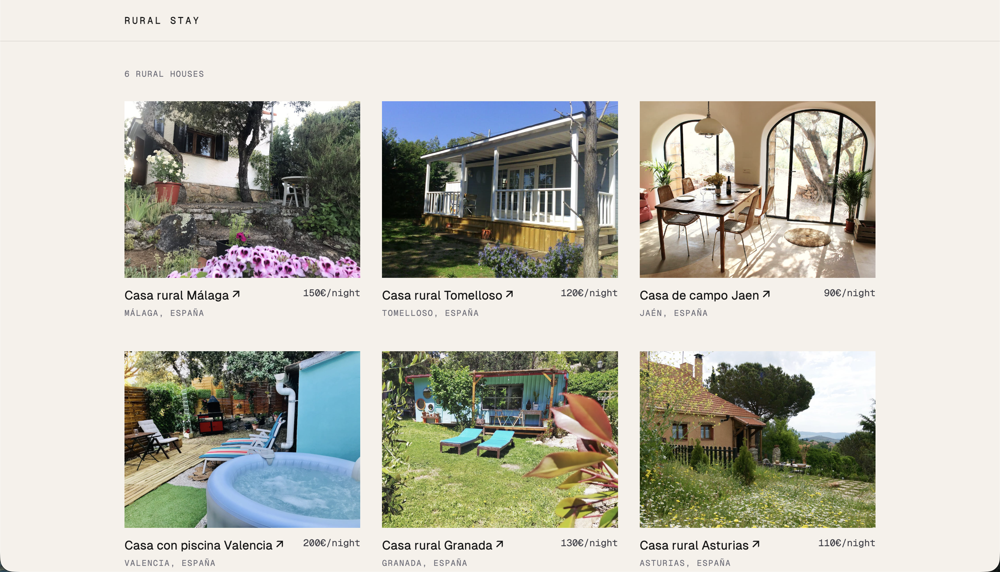
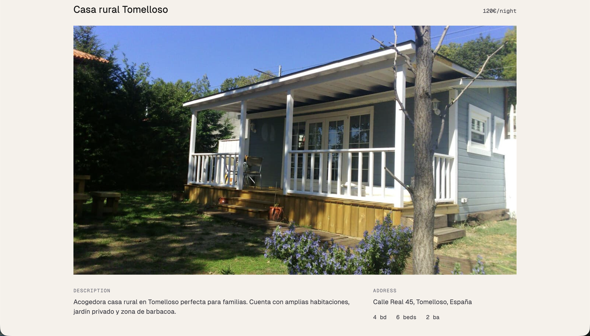

# Casas Rurales — TanStack Start

Rural house rental listing built with TanStack Start for the MetaFrameworks lab. Two screens: house listing and house detail, both pulling from the mock API server provided on the exercise.

## Demo

| Listing | Detail |
|---|---|
|  |  |

## Stack

- TanStack Start + TanStack Router (file-based routing) + TypeScript
- Tailwind CSS v4
- Mock API: [master-frontend-metaframeworks-lab](https://github.com/Lemoncode/master-frontend-metaframeworks-lab) (Hono server, port 3001)

## Decisions

| Area | Choice | Why |
|---|---|---|
| Rendering | SSR by default + `staleTime: 3600000` (1h) on both routes' loaders | TanStack Start doesn't have a build-time SSG concept like Next, so `staleTime` caches loader results, letting repeat visits within the window skip refetching, the closest equivalent to ISR here |
| Server-only data | `createServerFn` for `getHouses`/`getHouseById` | Wanted to keep API keys/secrets safe and avoid pulling data straight from the client, so I wrapped the fetch in `createServerFn` to protect it, even though there's no real secret to protect in this exercise |
| Env vars | Single `VITE_API_URL` (public) for image URLs, plus a private `API_URL` (server-only) used inside `createServerFn` for data fetching | Practiced both patterns: images need to resolve from the client bundle (Vite's `VITE_` prefix), while the actual data fetch is wrapped in a server function so a real secret key would never reach the browser |
| Folder structure | Layer-based (`routes/`, `components/`, `lib/`) over feature-based | Same reasoning as the Next.js version, single domain, no benefit to splitting by feature |
| Data shaping | API → ViewModel mappers (`lib/mappers.ts`) | Same pattern as Next.js, keeps formatting (price, location, image URL) out of JSX |
| 404 handling | `notFoundComponent` on the root route + `throw notFound()` in the detail loader | TanStack Router has no file-name convention for 404s like Next's `not-found.tsx`, so the component has to be registered explicitly so it renders in place, without changing the URL |
| Images | Plain `` | No image optimization added yet, TanStack's ecosystem option here is Unpic, not yet integrated |

## What's implemented

- House listing (`/`) with cards (image, name, location, price)
- House detail (`/houses/$id`) with description, address, room/bed/bath counts, and reviews
- Navigation between both screens
- Custom 404 page for non-existent house IDs

Not implemented (optional in the assignment): search/filter, booking button, image optimization (Unpic).

## Running locally

1. Start the mock API server (from the cloned `master-frontend-metaframeworks-lab/api-server` repo):

   ```
   npm install
   npm start
   ```

   Runs on `http://localhost:3001`.

2. In this project, create `.env`:

   ```
   API_URL=http://localhost:3001
   VITE_API_URL=http://localhost:3001
   ```

3. Install and run:

   ```
   npm install
   npm run dev
   ```

   Open `http://localhost:3000`.
